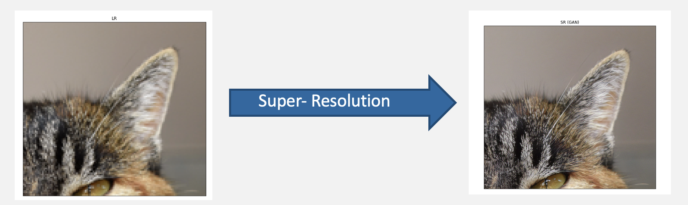
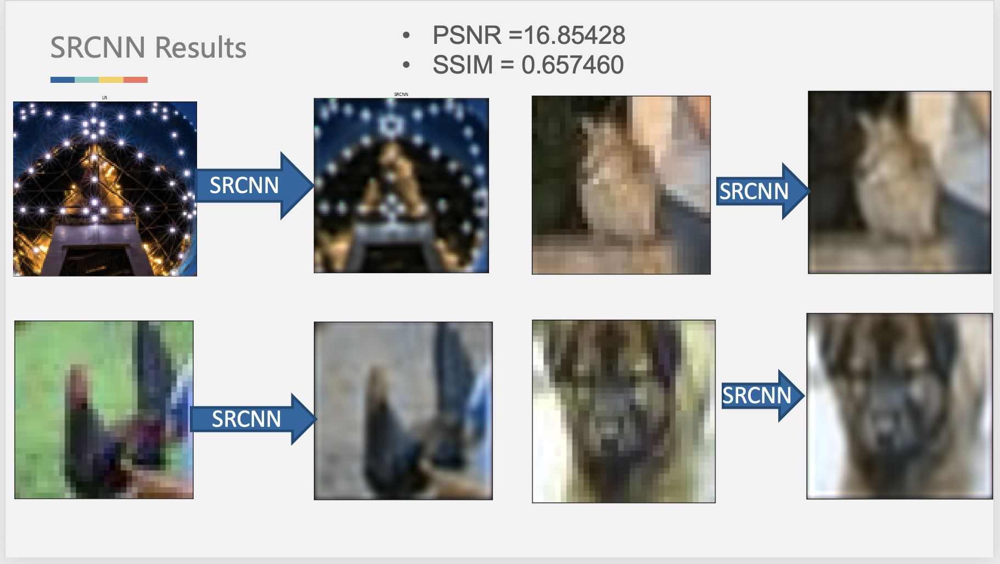

# Super-Resolution Imaging

## Problem Statement

Image super-resolution refers to the process of recovering a given low-resolution image into a corresponding high-resolution image by a specific algorithm. Specifically, it refers to the process of reconstructing a high-resolution image from a given low-resolution image by means of particular algorithms and processing processes using relevant knowledge in digital image processing, computer vision, and other fields. It aims to overcome or compensate for the problems of blurred imaging images, low quality, and unremarkable regions of interest due to the limitations of the image acquisition system or the acquisition environment itself. In lectures, we have learned many options to transform, sharpen, or smooth an image by utilizing computer vision algorithms, so it triggered our interest in exploring the field of image super-resolution deeply. Thus we wish to use this opportunity to implement computer vision algorithms in the image super-resolution field.

- Recover given low-resolution image into a corresponding high-resolution image
- Contain greater pixel density, richer texture details, and higher trustworthiness
- Greatly reduce the space required for storage



## Significance of Super-Resolution Imaging in Real World

Compared with low-resolution images, high-resolution images usually contain **greater pixel density, richer texture details, and higher trustworthiness**. Image super-resolution techniques have a wide range of applications and research implications in several fields. We can use image super-resolution to greatly reduce the space required for storage and the bandwidth required for transmission, enhance the image quality, improve the image quality, and enhance the user's visual experience. 

However, in practice, due to the constraints of acquisition equipment and environment, network transmission medium and bandwidth, image degradation model itself, we usually cannot directly obtain the ideal high-resolution image with sharpening edge and no block blur. The most direct way to improve image resolution is to improve the optical hardware in the acquisition system, but the physical solution to the low-resolution image problem is often too costly because the manufacturing process is difficult and expensive to improve significantly. As a result, techniques from the perspective of software and algorithms have become a crucial way to achieve super-resolution imaging. Using computer vision algorithms to reconstruct a super-resolution image has significant benefits to the real world.


## State-of-art Frameorks in Solving the Super-Resolution Imaging Problem

Image super-resolution is a relatively novel field in computer vision. The concept of the deep convolutional network was first applied to image super-resolution in 2014. Multiply deep learning neural networks were then used by researchers to solve this task in the recent year better.

- SRCNN: 
Super-Resolution Convolutional Neural Network (‘Image Super-Resolution Using Deep Convolutional Networks’, 2014). The low-resolution input is upscale to the desired size using bicubic interpolation to reconstruct a super resolution image. It use bicubic interpolation to enlarge the low-resolution image to the target size, and then fit the nonlinear mapping through a three-layer convolutional network. 


- SRGAN:
In 2017, Christian Ledig et al. proposed SRGAN, using a Generative Adversarial Network (GAN) for the first time to solve the image super-resolution problem. SRGAN uses perceptual loss and adversarial loss to improve the realism of the recovered images. 


- EDSR/WDSR: 
Enhanced Deep Residual Network (EDSR) and Wide Activation for Efficient and Accurate Image Super-Resolution (WDSR) use residual network techniques to solve image super resolution. The recovered images have a lower PSNR and SSIM value but have a realistic visual effect.


## Our Approach

1. Implement SRCNN, SRGAN, and EDSR frameworks

2. Use images picked by us for validation

3. Build a 3-layers convolutional neural network model, based on the idea of SRCNN framework

4. Re-implement Generative Adversarial Network(SRGAN) on project

5. Evaluate the performance difference between three frameworks using PSNR and SSIM


## SRCNN Implementation and Result

### Implementation
We use Mean squared error (MSE) as the loss function and trained it on CIFAR-10 dataset

### Result: 
1. The resolution of images improved
2. Pixel loss is relatively significant; some useful information in images is also lost
3. Evaluation metric value (PSNR and SSIM) are relatively low




```markdown
Syntax highlighted code block

# Header 1
## Header 2
### Header 3

- Bulleted
- List

1. Numbered
2. List

**Bold** and _Italic_ and `Code` text

[Link](url) and 
```

For more details see [Basic writing and formatting syntax](https://docs.github.com/en/github/writing-on-github/getting-started-with-writing-and-formatting-on-github/basic-writing-and-formatting-syntax).

### Jekyll Themes

Your Pages site will use the layout and styles from the Jekyll theme you have selected in your [repository settings](https://github.com/xingpengsun/639-final-project/settings/pages). The name of this theme is saved in the Jekyll `_config.yml` configuration file.

### Support or Contact

Having trouble with Pages? Check out our [documentation](https://docs.github.com/categories/github-pages-basics/) or [contact support](https://support.github.com/contact) and we’ll help you sort it out.
