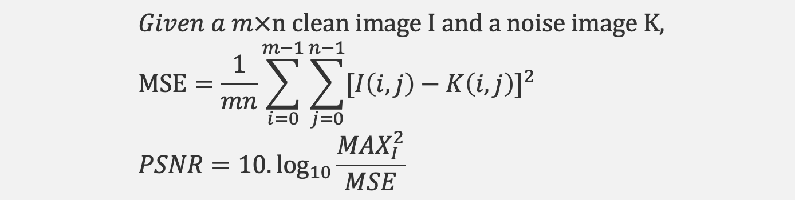

# Super-Resolution Imaging

CS639 Final Project--Yiwen Xu, Xingpeng Sun

Useful Link:
- Project Proposal (https://docs.google.com/document/d/e/2PACX-1vS99Wd1sXB8Z6nhq2qSQfb93kvwaMjLGk96aEHwmbzoiuKKXZNZQfprxPdxgOC8ELKgAhMDMCe0OC9F/pub)
- Midterm Report (https://docs.google.com/document/d/e/2PACX-1vTCNl2ot6cpm-uum_fin1sAWhDPC4SWvaRe7Nbk-uVrkHxo9m2O-Rc18LIM3JS-sJwZGIV7EDqiFYH4/pub)
- Final Presentation Slides (https://docs.google.com/presentation/d/10SfClXMF4nF8tHyq_OmXoB66pLqc1_QB/edit?usp=sharing&ouid=116887640948118439471&rtpof=true&sd=true)

## Problem Statement

Image super-resolution refers to the process of recovering a given low-resolution image into a corresponding high-resolution image by a specific algorithm. Specifically, it refers to the process of reconstructing a high-resolution image from a given low-resolution image by means of particular algorithms and processing processes using relevant knowledge in digital image processing, computer vision, and other fields. It aims to overcome or compensate for the problems of blurred imaging images, low quality, and unremarkable regions of interest due to the limitations of the image acquisition system or the acquisition environment itself. In lectures, we have learned many options to transform, sharpen, or smooth an image by utilizing computer vision algorithms, so it triggered our interest in exploring the field of image super-resolution deeply. Thus we wish to use this opportunity to implement computer vision algorithms in the image super-resolution field.

- Recover given low-resolution image into a corresponding high-resolution image
- Contain greater pixel density, richer texture details, and higher trustworthiness
- Greatly reduce the space required for storage

## Significance of Super-Resolution Imaging in Real World

Compared with low-resolution images, high-resolution images usually contain **greater pixel density, richer texture details, and higher trustworthiness**. Image super-resolution techniques have a wide range of applications and research implications in several fields. We can use image super-resolution to greatly reduce the space required for storage and the bandwidth required for transmission, enhance the image quality, improve the image quality, and enhance the user's visual experience. 

However, in practice, due to the constraints of acquisition equipment and environment, network transmission medium and bandwidth, image degradation model itself, we usually cannot directly obtain the ideal high-resolution image with sharpening edge and no block blur. The most direct way to improve image resolution is to improve the optical hardware in the acquisition system, but the physical solution to the low-resolution image problem is often too costly because the manufacturing process is difficult and expensive to improve significantly. As a result, techniques from the perspective of software and algorithms have become a crucial way to achieve super-resolution imaging. Using computer vision algorithms to reconstruct a super-resolution image has significant benefits to the real world.

## State-of-art Frameorks in Solving the Super-Resolution Imaging Problem

Image super-resolution is a relatively novel field in computer vision. The concept of the deep convolutional network was first applied to image super-resolution in 2014. Multiply deep learning neural networks were then used by researchers to solve this task in the recent year better.

- SRCNN: 
Super-Resolution Convolutional Neural Network (‘Image Super-Resolution Using Deep Convolutional Networks’, 2014). The low-resolution input is upscale to the desired size using bicubic interpolation to reconstruct a super resolution image. It use bicubic interpolation to enlarge the low-resolution image to the target size, and then fit the nonlinear mapping through a three-layer convolutional network. 

- SRGAN:
In 2017, Christian Ledig et al. proposed SRGAN, using a Generative Adversarial Network (GAN) for the first time to solve the image super-resolution problem. SRGAN uses perceptual loss and adversarial loss to improve the realism of the recovered images. 

- EDSR/WDSR: 
Enhanced Deep Residual Network (EDSR) and Wide Activation for Efficient and Accurate Image Super-Resolution (WDSR) use residual network techniques to solve image super resolution. The recovered images have a lower PSNR and SSIM value but have a realistic visual effect.

## Our Approach

1. Implement SRCNN, SRGAN, and EDSR frameworks

2. Use images picked by us for validation

3. Build a 3-layers convolutional neural network model, based on the idea of SRCNN framework

4. Re-implement Generative Adversarial Network(SRGAN) on project

5. Evaluate the performance difference between three frameworks using PSNR and SSIM

## Evaluation Metric
### PSNR (Peak Signal-to-Noise Ratio)
Term for the ratio between the maximum possible power of a signal and the power of corrupting noise that affect the fidelity of its representation

### SSIM (Structural Similarity Index)
It is a perception-based model that considers image degradation as perceived change in structural information, while also incorporating important perceptual phenomena, including both luminance masking and contrast masking terms

**For both evaluation metrics, higher value means better reconstruction effect**

## SRCNN Implementation and Result

### Implementation
We use Mean squared error (MSE) as the loss function and trained it on CIFAR-10 dataset

### Result: 
1. The resolution of images improved
2. Pixel loss is relatively significant; some useful information in images is also lost
3. Evaluation metric value (PSNR and SSIM) are relatively low

*On the left side, we show the input images; on the right side, we show the output images. The results of our SRCNN model reveal that the SRCNN model could improve the resolution of the image to some extent. The mosaic-like pictures become relatively smooth and have an improvement in resolution*

While we find out SRCNN cannot reconstruct high-resolution images, we continue to implement the SRGAN framework in the following.

## SRGAN Implementation and Result

### Impelementation
The generator generates a high-resolution image from a low-resolution image, and the discriminator determines whether the image is generated by the generator or the original image in the database. When the image generated by generator is indistinguishable by discriminator, then the super-resolution of the image is completed.

1. Trained model on DIV2K dataset
2. Generator: SRResNet
3. Discriminator: VGG19
4. SRGAN uses perceptual loss and adversarial loss to enhance the realism of the recovered images. Perceptual loss uses features extracted by convolutional neural network to make the generated image and the target image more similar in semantics and style (by comparing the difference between the features of the generated image after convolutional neural network and the features of the target image after convolutional neural network)

### Result
1. Reconstruct visually high quality images
2. PSNR and SSIM evaulation value is much higher

**So, we can see that SRGAN has better evaluation performance than SRCNN.
The model enhances the overall image visual effect with richer and more realistic details**

## Comparing EDSR with SRGAN

- EDSR

PSNR=30.74
SSIM=0.89

- SRGAN

PSNR=29.69
SSIM=0.86

Although EDSR's PSNR value is higher than that of SRGAN, visually we find that the image reconstructed by SRGAN is better. Thus, we find out PSNR may not be a very reliable evaluation metric.

Left image is reconstructed by EDSR and the right image is reconstructed by SRGAN.

## Discussion

- Develop new evaluation metrics to better represent the resolution results

The human eye is more sensitive to the contrast difference with lower spatial frequency, the brightness contrast difference than the chromaticity, and the human eye's eprception of an area will be affected by surronding area. PSNR based on error between corresponding pixels; does nnot consider human eye characteristics, so the evaluation results often appear to be inconsistent with people's subjective feelings.

- Develop models that has less computing complexity

The training time for current state-of-art frameworks are very long, and has large computing complexity. Models with less computing complexity could make super-resolution imaging task more efficient.

## Reference
- Dong, C., Loy, C. C., He, K., & Tang, X. (2015). Image super-resolution using deep convolutional networks. IEEE transactions on pattern analysis and machine intelligence, 38(2), 295-307.
- Ledig, C., Theis, L., Huszár, F., Caballero, J., Cunningham, A., Acosta, A., ... & Shi, W. (2017). Photo-realistic single image super-resolution using a generative adversarial network. In Proceedings of the IEEE conference on computer vision and pattern recognition (pp. 4681-4690).
- Lim, B., Son, S., Kim, H., Nah, S., & Mu Lee, K. (2017). Enhanced deep residual networks for single image super-resolution. In Proceedings of the IEEE conference on computer vision and pattern recognition workshops (pp. 136-144).
- Yu, J., Fan, Y., Yang, J., Xu, N., Wang, Z., Wang, X., & Huang, T. (2018). Wide activation for efficient and accurate image super-resolution. arXiv preprint arXiv:1808.08718.

